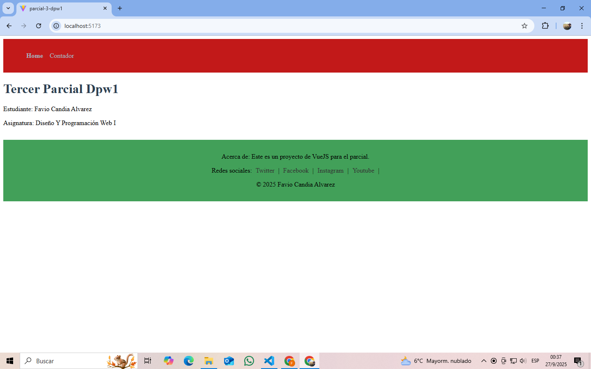

# 📝 Examen Parcial - Desarrollo Web con VueJS

**📅 Fecha:** 26 de septiembre de 2025  
**👨‍🎓 Estudiante:** favio candia alvarez
**📚 Asignatura:** Desarrollo Web I 

---

##  Descripción del Proyecto

Este proyecto fue realizado como parte del examen parcial de la asignatura **Desarrollo Web I**.  
Se utilizó **VueJS** con el empaquetador **Vite** para crear  las siguientes características:

- Uso de componentes reutilizables (`Navbar.vue`, `Footer.vue`, `HelloWorld.vue`)
- Ruteo entre vistas con `vue-router`
- Dos vistas: `Home.vue` y `Contador.vue`
- Un componente contador que incrementa y decrementa de 2 en 2
- Estilos aplicados por componente

###  Pantalla de inicio (Home)

###  Página del contador

